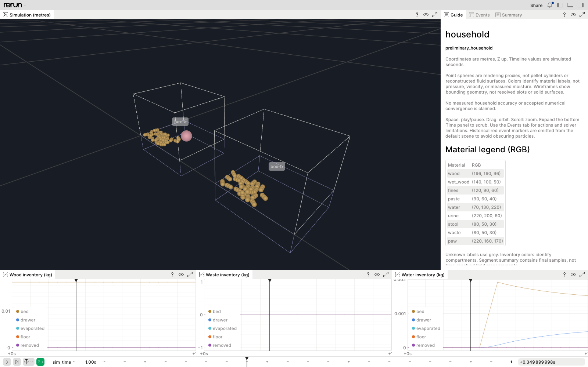
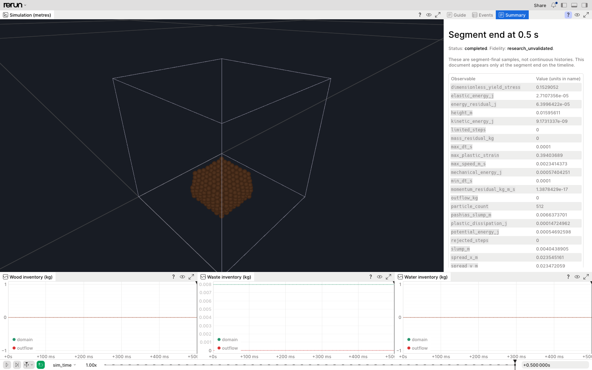

# Simulation replay

The browser shows recorded native states, not an animation substituted for the solver.
It is an inspection tool, not evidence of physical accuracy. Household results remain
`preliminary_household`; continuum fixtures remain `research_unvalidated`.

## Run and inspect

From the repository, choose fresh output directories:

```sh
uv run litter-physics run examples/household_basic.yaml --out outputs/demo-visual-household
uv run litter-physics view outputs/demo-visual-household --open-browser
# Ctrl-C before starting another viewer on the same ports.
uv run litter-physics run examples/research_slump.yaml --out outputs/demo-visual-slump
uv run litter-physics view outputs/demo-visual-slump --open-browser
```

The server binds only `127.0.0.1`. Keep the complete printed URL, including its
recording-server query. Use `--web-port` and `--grpc-port` for simultaneous viewers.
Ctrl-C, SIGTERM and `--duration` stop the server and release both ports; handlers are
installed before readiness checks so termination during startup also cleans up.

New recordings embed a layout with:

- A large 3D scene, explicit Z-up coordinates in metres, a camera based on the geometry
  bounds, household bed/drawer wireframes or the research domain.
- **Guide**: fidelity, proxy-shape limitations, controls and material RGB legend.
- **Events**: scheduled actions and solver warnings. Historical red event markers are
  still recorded, but excluded from the default scene so they do not hide particles.
- **Summary**: segment-final observables with units in their names. The document appears
  at the segment's end time, not before. An empty Summary tab before the first segment
  end is intentional. Resumed runs show the latest available segment summary.
- Separate wood, waste and water inventory charts, in kilograms, with named, consistently
  colored compartments. A zero trace is not missing data; final scalar observables are
  not presented as continuous histories.

Space plays/pauses; drag orbits; the wheel zooms. The bottom bar scrubs `sim_time`.
Double-click its numeric time field to enter a time such as `1s` or `500ms`. Expand the
Time panel for individual samples; use the panel's maximize button for long tables/logs.
The initial state is paused. Playback changes which stored snapshot is displayed;
it does not interpolate a new physical solution or rerun the solver.

Existing `.rrd` artifacts are immutable and retain their previous layout. These defaults
apply to newly generated recordings, not a silent rewrite of old runs. Saved browser
layout preferences may also override a recording's default layout.

## What the pictures mean

The household example has 48 pellets in two small boxes and a spherical motion proxy,
not a cat model. The visible spheres come from native display samples, including the
multisphere pellet approximation. They are not smooth pellet cylinders or a settled,
measured full-size bed. The wireframes do not render individual sifting slots or steel
surfaces. Colors encode material labels, not calibrated moisture or stress.

The slump example has 512 continuum material points. It does not reconstruct a fluid
surface. Per-point pressure/velocity coloring, stable particle-ID picking, cat meshes,
full-box validated examples and multi-run comparison dashboards are not implemented.
The household paste still does not spread or push pellets; a nicer replay does not
supply that missing physics. The native species inventories and final numerical
observables remain the quantitative data to inspect alongside the images.

## Inspected browser evidence

Actual compiled runs were opened in isolated Chromium 153 using WebGPU on the M4 Mac,
2026-09-21. Initial state, playback, numeric-time scrubbing to the final state, inventory
charts, event/warning tabs and final summaries were visually inspected. No JavaScript
page errors were captured. Other browser engines and resumed multi-segment playback
have not received this visual inspection; recording identity across resume is covered
by automated tests.

Household playback at approximately 0.35 simulated seconds, including the pink motion
proxy and the two boxes:



Slump at 0.5 simulated seconds with the segment summary. Its refinement study remains
unresolved; the displayed energy residual is not an energy-closure pass:



These screenshots are inspection evidence, not pixel-golden tests. Browser tooling is
not a runtime dependency. `make gate` verifies loadable recordings, geometry/context
entities, layout selections, summary timestamps, coordinate preservation, run identity,
and loopback/process cleanup. Real SIGTERM during both startup and serving was also
exercised in a separate CLI process and both ports were confirmed closed afterward.
